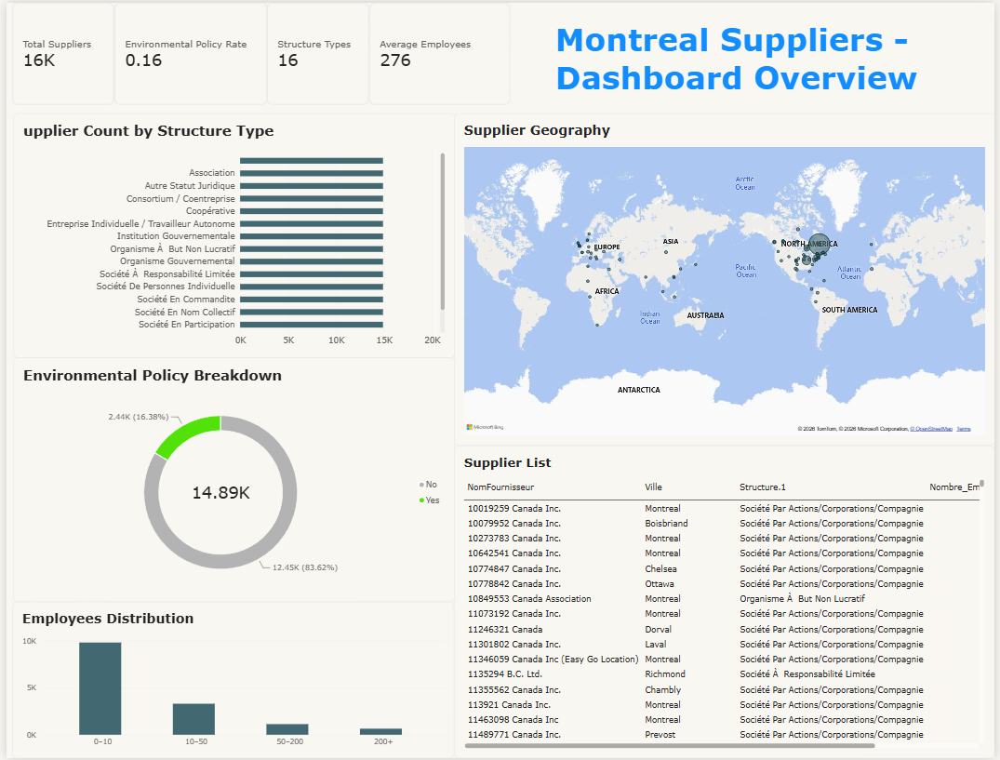

# 📊 Montreal Suppliers — Power BI Dashboard

A single‑page Power BI dashboard analyzing supplier structure, sustainability practices, employee distribution, and geographic presence across Montreal and surrounding regions.  
Built as a clean, professional portfolio project demonstrating data modeling, DAX, Power Query, and dashboard design.

---

## 🔍 Overview

This dashboard provides a high‑level analytical view of suppliers registered in Quebec.  
It includes:

- Supplier structure types  
- Environmental policy adoption  
- Employee count distribution  
- Geographic mapping  
- Searchable supplier table  
- KPI summary cards  

The design focuses on clarity, usability, and business relevance.

---

## 🧠 Key Insights

### **Supplier Structure Types**
Shows the distribution of suppliers by legal structure (Corporation, Sole Proprietorship, Partnership, etc.).

### **Environmental Policy Rate**
Displays the proportion of suppliers with a sustainable development policy (“Oui” / “Non”).

### **Employees Distribution**
Histogram of employee ranges (0–10, 10–50, 50–200, 200+), giving insight into supplier size.

### **Supplier Geography**
World map showing supplier locations, highlighting concentration in Montreal and international presence.

### **Supplier Table**
A searchable, filterable table containing:
- Supplier Name  
- City  
- Structure Type  
- Employee Count  
- Environmental Policy Status  

---

## 🛠️ Tools & Technologies

- **Power BI Desktop**  
- **Power Query** (ETL, data cleaning)  
- **DAX** (measures & calculated columns)  
- **REQ Supplier Dataset**  
- **Geocoding for city mapping**

---

## 🧹 Data Preparation

Data cleaning steps included:

- Standardizing structure types  
- Cleaning employee count values  
- Normalizing “Oui / Non” policy fields  
- Removing duplicates  
- Creating employee bins  
- Preparing geographic fields for mapping  

### Example DAX (Employee Bins)

```DAX
EmployeeBin =
SWITCH(
    TRUE(),
    FactFournisseur[Nombre_Employes_clean] <= 10, "0–10",
    FactFournisseur[NombreEmployes_clean] <= 50, "10–50",
    FactFournisseur[NombreEmployes_clean] <= 200, "50–200",
    "200+"
)
```
---

## 🎨 Dashboard Design
- Clean, modern layout

- Consistent spacing and alignment

- Professional color theme

- Clear visual hierarchy

- KPI cards for quick insights

- Searchable supplier table

- Slicers for interactive filtering

## 📸 Dashboard Overview




## 📁 Repository Structure
📁 montreal_suppliers_powerbi
│
├── README.md
├── montreal_suppliers.pbix
├── suppliers_clean.csv
└── suppliers-etl-overview-dashboard.png

## 🚀How to Use
1. Download the .pbix file

2. Open it in Power BI Desktop
 
3. Interact with slicers and visuals

4. Explore supplier insights

## 📌 Future Enhancements
- Add drill‑through Supplier Details page

- Integrate expense data (FactDepenses)

- Add ESG scoring

- Add time‑series trend analysis

## 👤 Author
Coco Wei  
Aspiring Financial Analyst / Data Analyst
Montréal, Québec